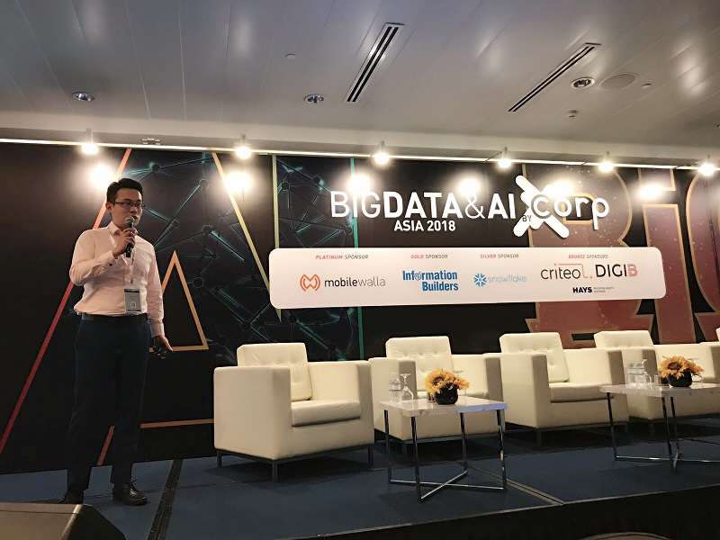
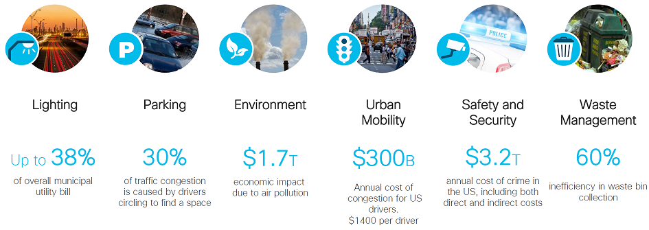
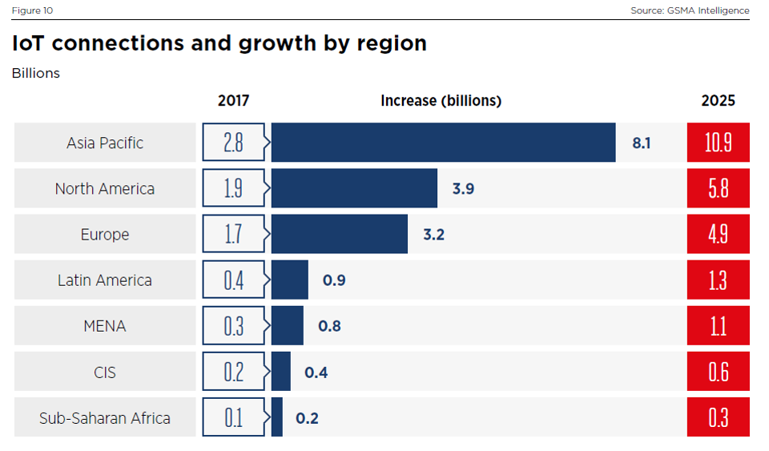

AI for Smart Cities
=======================

.. post:: Dec 07, 2018
   :tags: ai, smartcity
   :category: ComputerScience

I gave a presentation of 'AI for Smart Cities' in 'Big Data & AI Asia' conference which was hold in Suntec.

.. image:: images/suntec.jpg

This is a picture of my presentation.

What is Smart City?
=============================

Challenges of cities
---------------------------

Urbanization
By 2050 cities will accommodate about 66% percent of the world's population

Land
In 2012 cities occupied only about 3% of the global land area

Resource
In 2012 cities consumed about 75% of natural resources

GHG Emission
In 2012 cities produced 60%-80% of all greenhouse gas (GHG) emissions

According to investigation from Cisco, there are big improvements potential.

We have to adopt new and smart ways to address the increasing challenges. 
The solution must depends on the knowledge of cities which start from getting understand of data.

Data from cities
----------------------

Huge amount of data, from human being. 
Due the IoT technology boost, cheaper sensors, faster network, better toolset we predict more and more data will come from sensors which will be collected in an automatic manner.

The smart city problem is big data problem. It is all about how to acquire the data, manage the data, analyze the data, and bring value from the data.

Why AI is relevant to Smart City?
------------------------------------

The first question to answer is what is AI.
Any device that perceives its environment and takes actions that maximize its chance of successfully achieving its goals.

To put it simple, to get the data, do analytics then facilitate better decision making.

There are different persepctives to categorize AI technology:
Classical AI: rule based
Machine Learning:
Deep learning:

We can also categorize AI in supevised and unsupervised learning depends on whether the data is labled or not.
Regression or classification depends on whether the label is continous or 
we can either utilize cloud service to achieve AI work or we can develop in-house algorithem.

All the above choices are relevant to Smart city context depends on detailed scenario.

DNVGL Digital Hub Singapore on AI for Smart Cities
======================================================

Who we are?
--------------
Introduction
Link of url
Mix competence of data analytics, iot, software development

Focusing areas
-------------------

Infrastructure performance

Climate change

Cyber security

Smart lift
----------------

61,000 lifts in Singapore. The total number of lifts is projected to double to 121,100 in the next 10 years

Real estate manager want to understand the real-time status of the lifts but have to depend on lift expert
Regular check will be expensive and also delay the actions towards potential issues

Predictive maintenance, iot, anomaly detection

