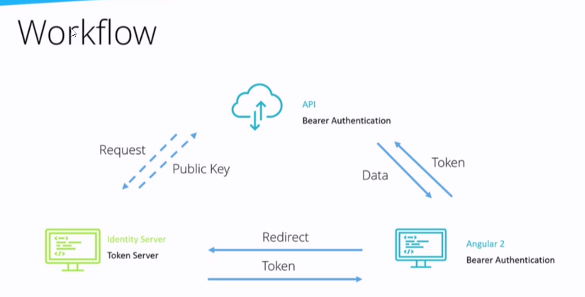
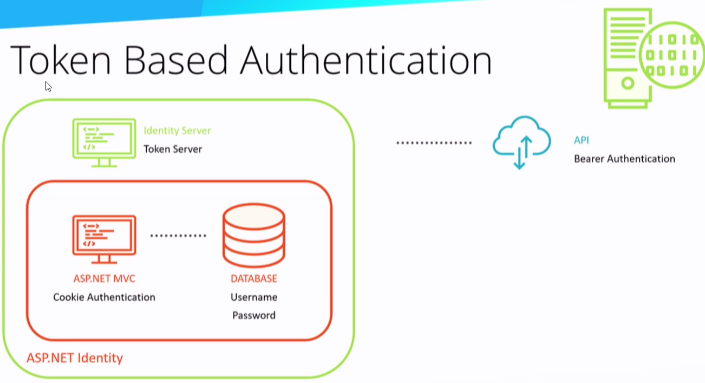
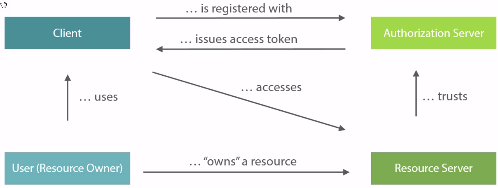
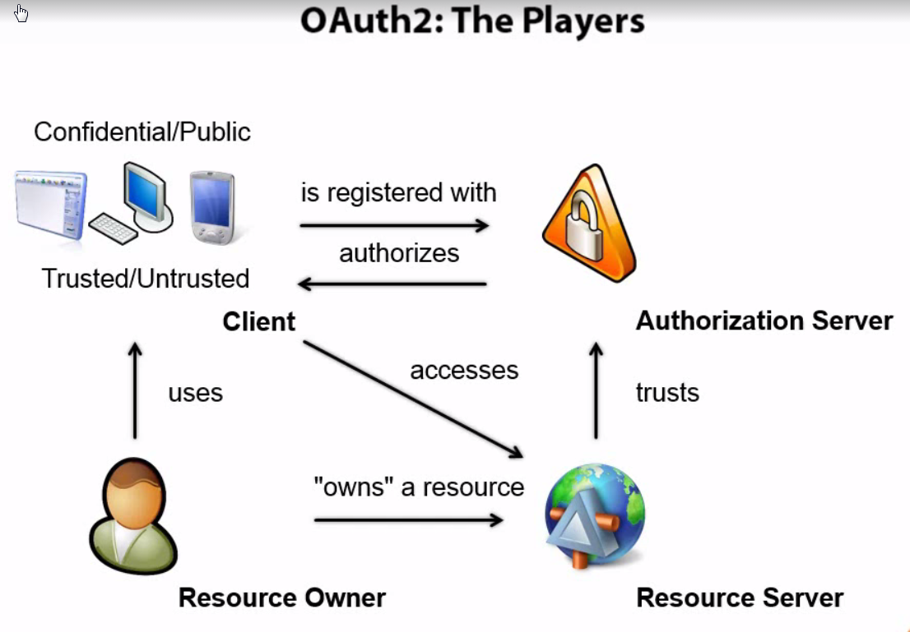
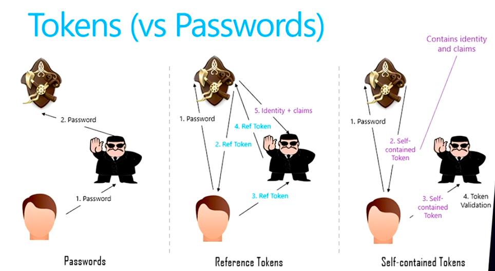
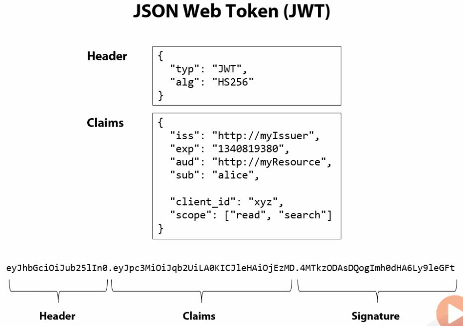
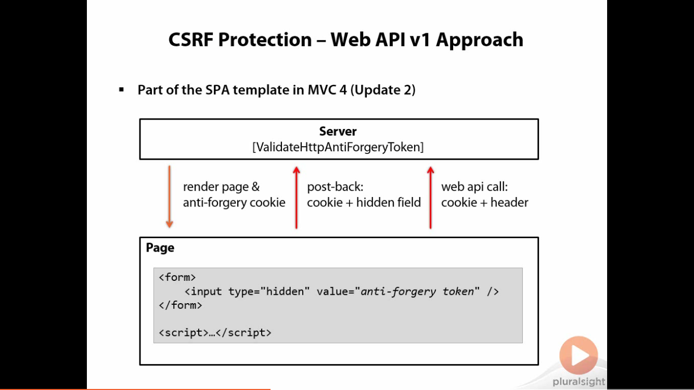
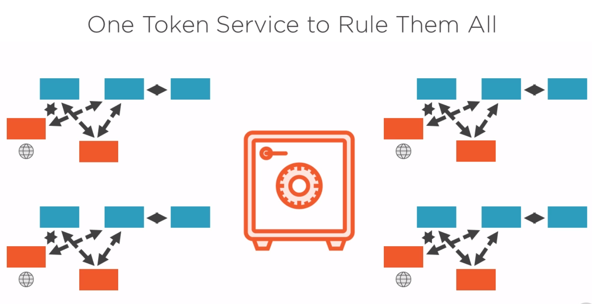

Authentication & Authorization Explainations
================================================

.. post:: Mar 14, 2018
   :tags: security
   :category: ComputerScience

.. contents::

ASP.net core
ASP.net identity: user authentication
Identity server 4: token server

What can Identity Server do:
compatible with any user system, not just ASP.net Identity
Includes external Auth via openid
Give out different claims to different clients
Third party developers
Single sign on

Token contains the access level

Oauth 2.0 isn't about authentication. It's about authorization. The standard doesn't say anything about the user.
From web, mobile and desktop application
	- Different types of applications require different means to achieve authorization
	- Where can the token be delivered to
	- Can the client application safely store secrets
Oauth only cares about resource scope and not identity scope

Oauth 2.0 flows
	- Client credentials
	- Authorization code
	- Implicit
Resource owner/password credentials

The main actors
	- User (resource owner): An entity capable of granting access to a protected resource
	- Client: An application making protected resource requests on behalf of the resource owner and with it authorization
	- Resource server: The server hosting the protected resources
Authorization server: The server issuing access tokens to the client after successfully authenticating the resource owner and obtaining authorization

Client
	- Confidential client: Clients capable of maintaining the confidentiality of their credentials
	web application, e.g. MVC application
	- Public client: clients incapable of maintaining the confidentiality of their credentials
	Native applications
		An IOS, Android, Windows Phone app built in a native language or compile-to-native language
	User-agent based applications
		javascript applications

Authorization endpoint
	- used by the client to obtain authorization from the resource owner via user-agent redirection
Token endpoint
	- used by the client to exchange an authorization grant for an access token, typically with client authentication
Redirection endpoint
used by the authorization server to return responses containing authorization credentials to the client via the resource owner user-agent

401 error is unauthorized error code

Enterprise protocol:
	- SOAP
	- SAML
	- WS*
Consumer protocol:
	- HTTP
	- JSON

Purpose of a security token
	- Security tokens are (protected) data structures
		○ contain information about issuer and subject (claims)
		○ signed (tamper proof & authenticity)
		○ typically contain an expiration time
	- A client requests a token
	- An issuer issue a token
	- A resource consumes a token
has a trust relationship with the issuer

History
---------
SAML 1.1/2.0
- XML based
- many encryption & signature options
- very expensive
Simple Web Token (SWT)
- Form/URL encoded
- symmetric signatures only
JSON Web Token (JWT)
- JSON encoded
- symmetric and asymmetric signatures (HMACSHA256-384, ECDSA, RSA)
- symmetric and asymmetric encryption (RSA, AES/CGM)
- (the new standard)

SAML is very secure and advanced, which requires XML protocol. Most mobile devices do not have this
Simple Web Token use symmetric algorithm, which is too simple
JWT is in-between

JSON Web Token
On its way to official standardization 
	o http://self-issued.info/docs/draft-ietf-oauth-json-web-token.html 
Header 
	o metadata 
	o algorithms & keys used 
Claims 
	Issuer (iss) 
	Audience (a ud) 
	IssuedAt(iat) 
	Expiration (exp) 
	Subject (sub) 
	...and application defined claims 

Producing a token 
Microsoft library on Nuget 
	o http://nuget.org/packages/Microsoft.ldentityModel.Tokens.JWT/ 

.. code:: 
	var token = new JWTSecurityToken( 
		issuer: "http://mylssuer" , 
		audience: "http: //myResource " , 
		claims: GetC1aims(), 
		signingCredentia1s: GetKey(), 
		validFrom: DateTime.UtcNow, 
		validTo: DateTime.UtcNow.AddHours(1)); 

	// serialize 
	var tokenString =
	new JWTsecurityTokenHand1er() . WriteToken(token); 

Consuming a token
Retrieve serialized token
	from HTTP header, quering string etc...
Validate token
	and turn into claims

.. code::
	var token = new JWTSecurityToken(tokenString)
	var validationParms = new TokenValidationParameters
	{
		ValidIssuer = "http://myIssuer",
		AllowedAudience = "http://myResource",
		SigningToken = GetSigningKey()
	};
	var handler = new JWTSecurityTokenHandler();
	var principal = handler.ValidateToken(token, validationParms);

Oauth does not build on SSL transportation protocol
Oauth2 has many variation, big players have their own implementations

High level overview: Resource server, client, resource owner

OAuth2 flows - with user interaction
	- Authorization Code flow
		○ Web application client
			§ Request authorization
			§ Request token
			§ Access resource
	- Implicit flow
		○ Native/local clients
			§ Request authorization & token
			§ Access resource
Oauth2 flows - no user interaction
	- Resource owner password credential flow
		○ Trusted clients
			§ Request token with resource owner credentials
			§ Access resource
	- Client Credential flow
		○ Client to service communication
			§ Request token with client credentials
			Access resource

Authorization Code Flow

Authorization request
	Resource owner to authorization server
	GET /authorize?client_id=webapp&
		scope=resource&
		redirect_uri=https://webapp/cb&
		response_type=code&
		state=123
Authentication
	Consent
Authorization Response
	Resource owner to Web Application (Client)
	GET /cb?code=xyz&state=123
Token Request
	Web Application (Client) to Authorization Server
	POST /token Authorization:Basic (client_id:secret)
	grant_type=authorization_code&
	authroization_code=xyz&
	redirect_uri=https://webapp/cb
Token Response
	Authorization Server to Web Application (Client)
	{
		"access_token": "abc",
		"expires_in": "3600",
		"token_type": "Bearer",
		"refresh_token": "xyz"
	}
Resource Access
	Web Application (Client) to Resource Server
	GET /resource Authorization: Bearer access_token
Refreshing the Token
	Web Application (Client) to Authorization Server
	POST /token Authorization:Basic (client_id:secret)
	grant_type=refresh_token&refresh_token=xyz

Summary - code flow
	- Designed for server-based applications
		○ Client can store secret securely on the server
	- Accountability is provided
		○ Access token never leaked to the browser
	Long-lived access can be implemented

Admin can revoke the token from the authorization server

Implicit Flow
There is no code anymore

Authorization Request
	Resource Owner & Client to Authorization Server
	GET /authorize?client_id=webapp&
		scope=resource&
		redirect_uri=https://webapp/cb&
		response_type=token&
		state=123
Token Response
	Authorization Server to Resource Owner & Client
	GET /cb#
		access_token=abc&
		expires_in=3600&
		state=123
Resource Access
	Resource Owner & Client to Resource Server
	GET /resource
	Authorization:
		Bearer access_token

Less secure, then there is no refresh token normally

Resource owner password credential flow
Token request
	Resource Owner & Client to Authorization Server
	POST /token
		Authorization: Basic (client_id:secret)
		grant_type=password&
		scope=resource&
		user_name=owner&
		password=password&
Authorization server return token
Resource access
Summary - resource owner credential flow
	- Resource owner credentials are exposed to client
		○ Users should not become accustomed to that
	- Still better to store access/refresh token on device than password
		If the developer is using that feature

Client Credentials Flow
No human involved at all
Client to Authorization Server
POST /token
	Authorization:Basic (client_id:secret)
	grant_type=client_credentials&
	scope=resource

"Classic" security is intranet-only 
	o plus maybe special customer facing (web) applications in the DMZ 
B2B federation using protocols like WS-Federation, SAML2p and WS-Trust 
Mobile devices are a game changer 
	no "enterprise security" integration 
	less powerful 
	.. but increasingly popular and business criticial 
New "common denominator" technologies 
	presentation (e.g. HTML5) 
	o authentication & authorization 

In real case, Oauth2 is mis-used for authentication problem, e.g. facebook

The problem
1. User logs into malicious app (app steals token)
2. Malicious developers uses stolen access token in legitimate app

Bearer Token 
A security token with the property that any party in possession of the token (a 
"bearer") can use the token in any way that any other party in possession of it 
can. Using a bearer token does not require a bearer to prove possession of 
cryptographic key material (proof-of-possession). 
bearer token can only works on SSL. Otherwise people can impersonate

Claims based authentication is about defining who you trust to give you accurate information about identity, and only ever using that information provided
Claims are the property on the identity

Acronyms
Relying Party (RP)
	Service Provider (SP)
	Client
User
	Subject
	Resource Owner
Identity Provider (IdP)
	Trusted Issuer
	Issuing Authority
	Authorization Server (AS)
	OpenID Provider (OP)
	Asserting Party (AP)

Token format: SAML, JWT

Flows 
Patterns for orchestrating communication between client and authorization server 
	server-rendered web applications 
	user-agent based web applications 
	native applications 
	machine-to-machine communication 
	federation 
Ability to treat the client as partially trusted 
	o as well as client authentication 

Authorization:
https://www.xaprb.com/blog/2006/08/16/how-to-build-role-based-access-control-in-sql/
https://www.xaprb.com/blog/2006/08/18/role-based-access-control-in-sql-part-2/
thinktecture.AuthorizationServer

Separating user credentials from the client

Local/mobile/user-agent based clients
- Implicit flow

Server-based/confidential clients
- Authorization code flow

Summary - Implicit Flow 
User enters credentials at the authorization server 
	o not at the client 
authorization server returns (short lived) access token 
	to reduce exposure of token 
Often combined with OS helper mechanisms 
	o cookie container 
	native APIs 

Authroization Code Flow (Server-based Clients)
Resource Owner to Web Application (Client) to Resource Owner

Summary - Code Flow 
Designed for "confidential" clients 
	o client can store secret securely 
	o client authentication and authorization based on client identity possible 
	o typically server-based applications 
Accountability is provided 
	access token never leaked to the browser 
Long-lived access can be implemented 

Crossing Trust Boundaries... 
So far authorization server and resource server are always in the same 
trusted subsystem 
	o your client accessing your back-end 
	o facebook client accessing facebook back-end 
	o translate between identity management systems 
What if you want to cross the line? 
	o Assertion Flow 

OWIN: Authentication middleware: cookie authentication, token authentication

Windows Authentication 
Classic intranet scenarios 
	o all parties belong to Active Directory 
	o no code, just configuration 
Not really suited for anything else 
	o CSRF issues 

Using Same-Domain for Authentication 
Web APIs inherit security settings of web host 
	o e.g. cookies, Windows/Basic authentication, client certs... 
Application (Domain) 
	Authentication 
		Web APIs <-> Pages $.ajax 

Identity Framework: authenticate locally
	- add claims to a user
	- customize a user
	- token provider
	- two factor authentication
lockout (input password wrongly several times)

Identity framework is mainly for web app, which is not enough for the microservices architecture

Need a token service 

It is called single sign on

Token service encrypt token by using private key, and the client decrypt by using public key

Standards:
Identity: OpenID Connect (OIDC)
Access: OAuth2

*Written by Binwei@Oslo*