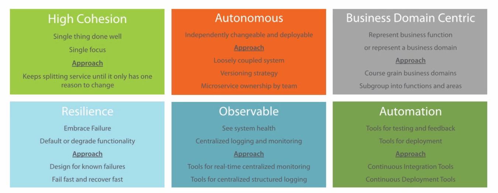
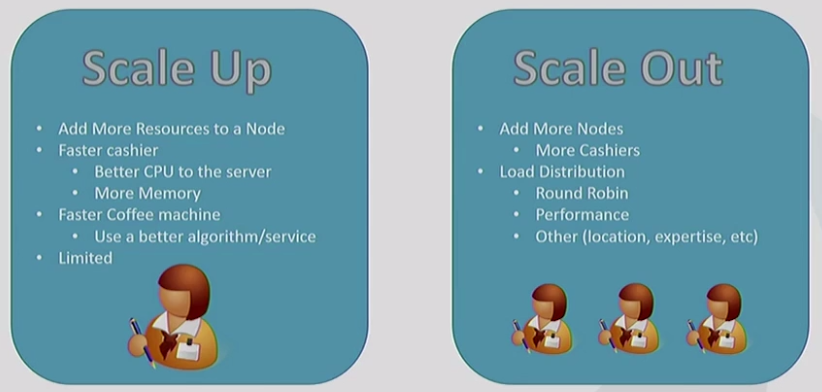
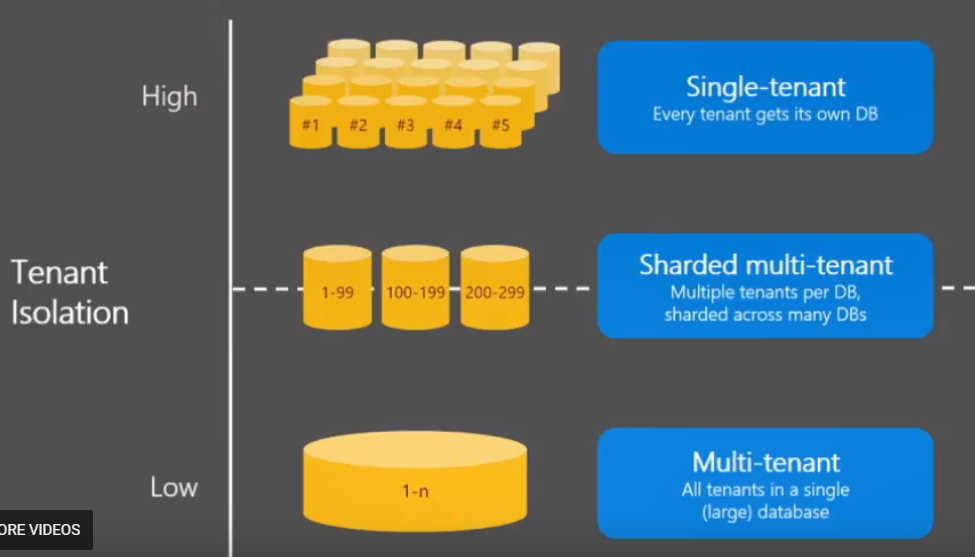
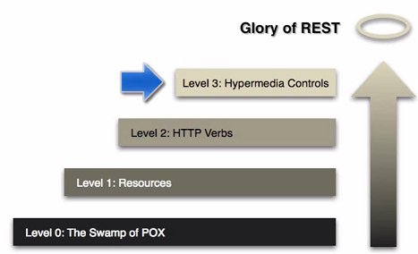
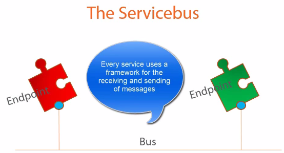

Cloud Patterns
===================

.. post:: Mar 07, 2018
   :tags: architecture, cloud
   :category: ComputerScience

Microservice is a software architecture style, in which complex applications are composed of small, autonomous process communicating with each other using language-agnostic API.
It has very low platform/behavioral/temporal coupling.
This blog introduces the microservice and common cloud patterns.

.. contents::

Microservices Design Principles
=================================

High cohesion
---------------

High cohesion means single focus and single responsibility.
It follows SOLID principle, which means service only change for one reason.

Autonomous 
-----------------

* Loose coupling 
* Honor contracts and interfaces 
* Stateless 
* Independently changeable 
* Independently deployable 
* Backwards compatible 
* Concurrent development 

Approach: 

* Communication by network: synchronous, asynchronous (publish/subscribe to events)
* Technology agnostic API 
* Avoid client libraries 
* Contracts between services: fixed and agreed interfaces, shared models, clear input and output 
* Avoid chatty exchanges between services 
* Avoid sharing between services: databases, shared libraries 
* Microservice ownership by team: responsibility to make autonomous, agreeing contracts between teams, responsible for long-term maintenance, collaborative development (communicate contract requirements, communicate data requirements), concurrent development 
* Versioning: avoid breaking changes, backwards compatibility, integration tests, have a versioning strategy (concurrent versions: old and new; semantic versioning: Major.Minor.Patch (e.g. 15.1.2); coexisting endpoints: /V2/customer/)

Business Domain Centric 
----------------------------

* Service represents business function, e.g. accounts department or postage calculator 
* Scope of service and identify boundaries (Bounded context from DDD)
* Shuffle code if required: group related code into a service, aim for high cohesion 
* Responsive to business change 

Approach: 

* Identify business domains in a coarse manner 
* Review sub groups of business functions or areas 
* Review benefits of splitting further and fix incorrect boundaries: merge or split 
* Agree a common language 
* Microservices for data (CRUD) or functions 
* Explicit interfaces for outside world 
* Splitting using technical boundaries 

Resilience 
---------------

* Embrace failure 
		Another service 
		Specific connection 
		Third-party system 
* Degrade functionality 
* Default functionality 
* Multiple instances 
		Register on startup 
		Deregister on failure 
* Types of failure 
		Exceptions\Errors 
		Delays 
		Unavailability 
* Network issues 
		Delay 
		Unavailability 
* Validate input 
		Service to service 
		Client to service 

Approach: Resilience 

* Design for known failures 
* Failure of downstream systems 
		Other services intern I or external 
* Degrade functionality on failure detection 
* Default functionality on failure detection 
* Design system to fail fast 
* Use timeouts 
		Use for connected systems 
		Timeout our requests after a threshold 
		Service to service 
		Service to other systems 
		Standard timeout length 
		Adjust length on a case by case basis 
* Network outages and latency 
* Monitor timeouts 
* Log timeouts 

Microservices Design Principles: Observable 
-----------------------------------------------

* System Health 
		Status 
		Logs 
		Errors 
* Centralized monitoring 
* Centralized logging 
* Why 
		Distributed transactions 
		Quick problem solving 
		Quick deployment requires feedback 
		Data used for capacity planning 
		Data used for scaling 
		Whats actually used 
		Monitor business data 

Approach: Observable 

* Centralized monitoring 
* Real-time monitoring 
* Monitor the host 
			CPU, memory, disk usage, etc. 
* Expose metrics within the services 
			Response times 
			Timeouts 
			Exceptions and errors 
* Business data related metrics 
			Number of orders 
			Average time from basket to checkout 
* Collect and aggregate monitoring data 
			Monitoring tools that provide aggregation 
			Monitoring tools that provide drill down options 
* Monitoring tool that can help visualise trends 
* Monitoring tool that can compare data across servers 
* Monitoring tool that can trigger alerts 
* Centralized Logging 
* When to log 
			Startup or shutdown 
			Code path milestones (Requests, responses and decisions)
			Timeouts, exceptions and errors 
* Structured logging 
			Level (Information, Error, Debug, Statistic)
			Date and time 
			Correlation ID 
			Host name 
			Service name and service instance 
			Message 
* Traceable distributed transactions 
			Correlation ID 
				Passed service to service 

Microservices Design Principles: Automation 
---------------------------------------------

* Tools to reduce testing 
		Manual regression testing 
		Time taken on testing integration 
		Environment setup for testing 
* Tools to provide quick feedback 
		Integration feedback on check in 
		Continous Integration 
* Tools to provide quick deployment 
		Pipeline to deployment 
		Deployment ready status 
		Automated deployment 
		Reliable deployment 
		Continuous Deployment 
* Why 
		Distributed system 
		Multiple instances of services 
		Manual integration testing too time consuming 
		Manual deployment time consuming and unreliable 

Approach: Automation 

* Continuous Integration Tools 
		Work with source control systems 
		Automatic after check-in 
		Unit tests and integration required 
		Ensure quality of check-in (Code compiles, Tests pass, Changes integrate, Quick feedback )
		Urgency to fix quickly 
		Creation of build 
		Build ready for test team 
		Build ready for deployment 

* Continuous Deployment Tools 
	Automate software deployment 
		Configure once 
		Works with Cl tools 
		Deployable after check in 
		Reliably released at anytime 
	Benefits 
		Quick to market 
		Reliable deployment 
		Better customer experience 

Others
--------

Communication: Synchronous 

* Request response communication 
		Client to service 
		Service to service 
		Service to external 
* Remote procedure call 
		Sensitive to change 
* HTTP 
		Work across the internet 
		Firewall friendly 
* REST 
		CRUD using HTTP verbs 
		Natural decoupling 
		Open communication protocol 
		REST with HATEOS 
* Synchronous issues 
		Both parties have to be available 
		Performance subject to network quality 
		Clients must know location of service (host\port) 

Communication: Asynchronous 

* Event based 
		Mitigates the need of client and service availability 
		Decouples client and service 
* Message queueing protocol 
		Message Brokers 
		Subscriber and publisher are decoupled 
		Microsoft message queuing (MSMQ) 
		RabbitMQ 
		ATOM (HTTP to propagate events) 
* Asynchronous challenge 
		Complicated 
		Reliance on message broker 
		Visibility of the transaction 
		Managing the messaging queue 
* Real world systems 
		Would use both synchronous and asynchronous 

Hosting Platforms: Registration and Discovery 

* Where? 
		Host, port and version 
* Service registry database 
* Register on startup 
* Deregister service on failure 
* Cloud platforms make it easy 
* Local platform registration options 
		Self registration 
		Third-party registration 
* Local platform discovery options 
		Client-side discovery 
		Server-side discovery 

Observable Microservices: Monitoring Tech 

* Centralised tools 
		Nagios 
		PRTG 
		Load balancers 
		New Relic 
* Desired features 
		Metrics across servers 
		Automatic or minimal configuration 
		Client libraries to send metrics 
		Test transactions support 
		Alerting 
* Network monitoring 
* Standardise monitoring 
		Central tool 
		Preconfigured virtual machines or containers 
* Real-time monitoring 

Observable Microservices: Logging Tech 

* Portal for centralised logging data 
		Elastic log 
		Log stash 
		Splunk 
		Kibana 
		Graphite 
* Client logging libraries 
		Serilog 
		and many more... 
* Desired features 
		Structured logging 
		Logging across servers 
		Automatic or minimal configuration 
		Correlation\Context ID for transactions 
* Standardise logging 
		Central tool 
		Template for client library 

Microservices Performance: Caching 

* Caching to reduce 
		Client calls to services 
		Service calls to databases 
		Service to service calls 
* API Gateway\Proxy level 
* Client side 
* Service level 
* Considerations 
		Simple to setup and manage 
		Data leaks 

Microservices Performance: API Gateway 

* Help with performance 
		Load balancing 
		Caching 
* Help with 
		Creating central entry point 
		Exposing services to clients 
		One interface to many services 
		Dynamic location of services 
		Routing to specific instance of service 
		Service registry database 
* Security 
		API Gateway 
		Dedicated security service 
		Central security vs service level 

Brownfield Microservices: Migration 

* Code is organised into bounded contexts 
		Code related to a business domain or function is in one place 
		Clear boundaries with clear interfaces between each 
* Convert bounded contexts into microservices 
		Start off with one, Use to get comfortable 
		Make it switchable, Maintain two versions of the code 
* How to prioritise what to split? 
		By risk 
		By technology 
		By dependencies 
* Incremental approach 
* Integrating with the monolithic 
		Monitor both for impact 
		Monitor operations that talk to microservices 
		Review and improve infrastructure 
		Incrementally the monolithic will be converted 

Greenfield Microservices: Introduction 

* New project 
* Evolving requirements 
* Business domain 
		Not fully understood 
		Getting domain experts involved 
		System boundaries will evolve 
* Teams experience 
		First microservice 
		Experienced with microservices 
* Existing system integration 
		Monolithic system 
		Established microservices architecture 
* Push for change 
		Changes to apply microservice principles 

Greenfield Microservices: Approach 

* Start off with monolithic design 
		High level 
		Evolving seams 
		Develop areas into modules 
		Boundaries start to become clearer 
		Refine and refactor design 
		Split further when required 
* Modules become services 
* Shareable code libraries promote to service 
* Review microservice principles at each stage 
* Prioritise by 
		Minimal viable product 
		Customer needs and demand 

Microservices Provisos 

* Accepting initial expense 
		Longer development times 
		Cost and training for tools and new skills 
* Skilling up for distributed systems 
		Handling distributed transactions 
		Handling reporting 
* Additional testing resource 
		Latency and performance testing 
		Testing for resilience 
* Improving infrastructure 
		Security 
		Performance 
		Reliance 
* Overhead to mange microservices 
* Cloud technologies 
* Culture change 

Saga
==========

https://docs.particular.net/nservicebus/sagas/

A saga is a class that represents a running instance of a business process. 
Depending on the actual capabilities of the bus you use, the saga can be persisted, suspended and resumed as appropriate. 

Event sourcing
=================

Event sourcing contain all the event and changes
By adding event sourcing to an application, you get a hold of raw data. 
By combining event sourcing and CQRS you end up with raw business events stored in the command stack properly denormalized for the sake of the application core functions.
At any time, though, you can add an extra module that reads raw data and transforms that into other meningful chunks of information for whatever business purpose you might have.

When it comes to highlighting the benefits of event sourcing, the first point usually mentioned is this: with events you never miss a thing of what happens within the system.

.. image:: images/multiple_projections.png

In a create, read, update, delete (CRUD) system, you typically have one representation of data - mostly relational - and one or more simple projects that most of the time just adapter tabular data to the needs of the presentation layer.
With event sourcing, you take this model much further, and lowering the abstraction level of the stored data is the key factor.
The more domain-accurate information you store, the richer and more numerious projections you can build at any later time.

An approach to persistence that concentrates on persisting all the changes to a persistent state, rather than persisting the current application state itself.
Combined the usage of snapshot.

CQRS
=========

In-house business intelligence with events and CQRS
Dino Esposito

Data Integration patterns
===========================

The four most common design patterns for data integration are broadcast, aggregation, bidirectional synchronization and correlation.

Static files on webserver antipattern

* Load increase
* Cost
* Update requires deployment
* Limited storage on server

Static Content Hosting Pattern -> put the files to storage service, e.g. Azure blob

Storage limits mitigation - replication

* Multiple blobs
* Multiple containers\buckets
* Multiple accounts
* How to do the balancing?

Content Delivery Network (CDN) pattern

Uploading to storage
Do not use web server to do upload, use storage service

Circuit breaker pattern

* Circuit breaker pattern prevent repeatedly trying to execute an operation that is likely to fail
* The circuit breaker is a proxy that monitors the number of recent failures
* Prevents wasting valuable resources because of the wait
* Normally, the client has some retry logic

Multiple tenants app

* Per-tenant cost
* Scale: number of tenants, data volume, workload
* Tenant isolation: security, performance, lifetime management, etc
* business continuity, disaster recovery
* customization per-tenant (for some ISVs)

Others
===========

Scaling Applications with Microservices and NServiceBus

Architecture

* Monolith
* Distributed application
* Microservices
* Servicebus

Coupling

* Platform coupling
* Behavior coupling
* Temporal coupling

Richardson maturity model

http://martinfowler.com/articles/richardsonMaturityModel.html

SignalR:
ASP.NET SignalR is a new library for ASP.NET developers that makes it incredibly simple to add real-time web functionality to your applications. What is "real-time web" functionality? It's the ability to have your server-side code push content to the connected clients as it happens, in real-time.
You may have heard of WebSockets, a new HTML5 API that enables bi-directional communication between the browser and server. SignalR will use WebSockets under the covers when it's available, and gracefully fallback to other techniques and technologies when it isn't, while your application code stays the same.
SignalR also provides a very simple, high-level API for doing server to client RPC (call JavaScript functions in your clients' browsers from server-side .NET code) in your ASP.NET application, as well as adding useful hooks for connection management, e.g. connect/disconnect events, grouping connections, authorization.

ServiceBus: message queue, register, subscribe
 
NServiceBus -> .net service bus
Keep the underlying transpose abstract
 
Transpose: (can be configured in NServiceBus)
-MSMQ queues:Computer management -> Service and Applications -> Message Queuing -> Private queues
-RabbitMQ supports multiple platforms, MSMQ is windows native
-Sql server
-Azure: Queues, Service bus

NServiceBus:
ServiceBus for .net

Actor model:
http://www.brianstorti.com/the-actor-model/

