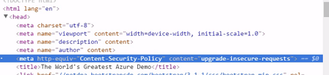
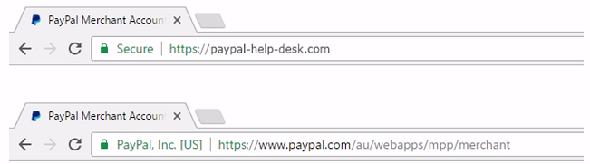

Https Explainations
===========================

.. post:: Jan 24, 2018
   :tags: security
   :category: ComputerScience

Hypertext Transfer Protocol Secure (HTTPS) is a safer version of HTTP, which is the communications protocol of the World Wide Web.
An HTTPS session is encrypted using either the SSL protocol (Secure Socket Layer) or TLS protocol (Transport Layer Security) and offers protection against "eavesdropping" and that any change in the transmitted data.

Introduction
=================

First Man in the middle attack in Chinese history. From "资治通鉴":

春，黑山贼帅张燕与公孙续率兵十万，三道救之。
未至，瓒密使行人赍书告续，使引五千铁骑于北隰之中，起火为应，瓒欲自内出战。
绍候得其书，如期举火。
瓒以为救至，遂出战。
绍设伏击之，瓒大败，复还自守。

Typical Man in the middle Insertion Points:

* Browser
* Wireless Router
* ISP
* Web Server

SSL: Secure Sockets Layer
TLS: Transport Layer Security

Tech details
===============

TLS handshake

* client talk to server, which communication protocol it supports, which cipher suite it supports
* server talk to client and agree on the communication protocol and cipher suite and public key
* client use the public key to verify whether this is the real website through CA
* client start key exchange which is encrypted by using public key
* server finished and communication begins the handshake is not encrypted

Downgrade the communication version. Client claims it only has lower TLS version, and force the communication to be on lower version. Then use the opportunity to attack

Redirecting to HTTPS

* Client send http request
* Server return HTTP 301
* Client starts https request

Through testing in Chrome network tab cannot see http 301 response
Redirecting model has MIM risk, not safe

HTTP strict transport security (STS)
You will not see 301 response, but 
Strict-Transport-Security:
max-age=15552000;
in the header
Go to HTTP site again, and you will 307 (internal redirect) 
But TOFU (Trust on first use)
Something in the header: strict-transport-security: max-age=31536000; includeSubDomain;preload
HSTSPreload.org
HSTS: HTTP Strict Transport Security
Force all the http requests converted into https, including CSS, Javascript, fonts, images, favicon, media, etc

Mixed Content:
If your page contains unsecure resource, e.g. images, videos in iframe, https is not impleted correctly
If you just use //www.resourceaddress in your code, then it will 'inherit' the parent scheme when get the resource
Or use CSP

Extended validation certificate

When a web server is set up to accept https connections, the administrator must create a digital certificate for the web server.
This certificate must then be signed by a certificate authority. This proves that the certificate owner is really the entity it states to be
Browsers are generally distributed with the signing certificates of known certificate authorities in order to verify that the certificates were really signed by them.

Tools relevant
====================

PowerShell cmlet: New-SelfSignedCertificate, Export-PfxCertificate can generate certificate locally (pfx file)

By default, Fiddler can monitor http very well, but not https. 
Fiddler almost can see no communication if visit https websites.
Port 443 is the default port for https
Check on the following options in Fiddler can see the https communication:
HTTPS tab, Decrypt HTTPS traffic
What Fiddler has done is a man in the middle attack on the machine

See Cookies:
F12 -> Application tab -> Cookies
Secure cookie cannot be get if it is on http channel

Chrome browser, press F12 and goto Security tab, you can see the certificates of the https web site

certmgr.msc, to see the trusted CA (Firefox has its own CA manager)

Relevant websites
======================

https://badssl.com/

http://caniuse.com
Web page to see the browser for various features

istlsfastyet.com
is a good source to read about TLS

httpvshttps.com
You can see https is faster to load
F12 -> Network -> Waterfall, the reason is https allows streaming content come all together

Certificate is not free. But you can use Let's encrypt: letsencrypt.org
certbot.eff.org can automate the certificate process

Cloudflare is reverse proxy which can play as cache, provide certificate, etc

www.ssllabs.com

HTTPS improves SEO
https://webmasters.googleblog.com/2014/08/https-as-ranking-signal.html

*Written by Binwei@Oslo*
