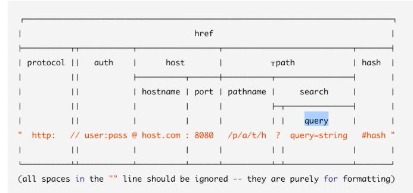

Node.js Basics
==================

.. post:: Aug 11, 2018
   :tags: web, backend
   :category: ComputerScience

Recently, I used Node.js quite a lot to handle personal projects. It is easy to start, and also easy to get wrong. 
This blog covers the basics part of Node.js development.

.. contents::

Every module in node is singleton

Require:
First find js file
Then json file
Then node file

require() can inject objects

use exports keyword to make properties and methods available outside of the module file.

.. code:: 

	exports.myDateTime = function () {
	    return Date();
	};

also use require() to include homegrown node module

If the module name is index.js, then it is okay just write directory name in the require parameter.

Event model -> event loop
The entity that handles external events and converts them into callback invocations
A loop that picks events from the event queue and pushes their callbacks to the call back stack
Node will process the event queue when call stack is empty

Difference between:
* setTimeout
* setImmediate
* Process.nextTick (not relevant event loop)

url parse

.. code:: 

    url.parse('https://www.pluralsight.com/search?q=buna')

    Url {
    protocol: 'https:',
    slashes: true,
    auth: null,
    host: 'www.pluralsight.com',
    port: null,
    hostname: 'www.pluralsight.com',
    hash: null,
    search: '?q=buna',
    query: 'q=buna',
    pathname: '/search',
    path: '/search?q=buna',
    href: 'https://www.pluralsight.com/search?q=buna' }

example

.. code::

    http.createServer(function (req, res) {
      res.writeHead(200, {'Content-Type': 'text/html'});
      var q = url.parse(req.url, true).query;
      var txt = q.year + " " + q.month;
      res.send(txt);
    }).listen(8080);

Use the url for testing: http://localhost:8080/?year=2017&month=July
Output is: 2017 July

If there is error, can use res.status(500).send(err) to return the error code

.. code:: 

    bookRouter.route('/Books/:bookId').get(function(req, res)) {
        Book.findById(req.params.bookId, function(err, book) {
            if (err) {
                res.status(500).send(err);
            } else {
                res.json(book);
            }
        })
    }

Javascript in node.js app, differentiate client and server code.
For example: server can call require while client can call windows
server code modification needs to restart node to see the changes, while client code just need browser refresh
console.log in the server code will output the message to terminal app, the client code will output the message the browser console

http module

write header or content

.. code::

    var http = require('http');
    http.createServer(function (req, res) {
      res.writeHead(200, {'Content-Type': 'text/html'});
      res.write('Hello World!');
    res.write(req.url); // read query string
      res.end();
    }).listen(8080);

File module

.. code::

    require(fs)
    var http = require('http');
    var fs = require('fs');
    http.createServer(function (req, res) {
      fs.readFile('demofile1.html', function(err, data) {
        res.writeHead(200, {'Content-Type': 'text/html'});
        res.write(data);
        res.end();
      });
    }).listen(8080);

Asymmetric programming
Here is how Node.js handles a file request:

* Sends the task to the computer's file system.
* Ready to handle the next request.
* When the file system has opened and read the file, the server returns the content to the client.

write file:
fs.appendfile(), fs.open(), fs.writefile()

delete file:
fs.unlink()

rename:
fs.rename()

npm

Npm start
Npm test
Will run when there is start/test script in the package.json

Npm -h to show the help
Npm help command: can open a browser

Npm init: will create the package.json

Npm list: list all installed packages

Npm can install global package, and can also install in local repository

Semantic version: major.minor.patch

* Patch increase when bug fixing
* Minor increase when introduce new feature
* Major increase when breaking changes

Npm can specify the versions when using npm I
In the package.json: ^menas major version can be greater, ~means minor version can be greater
Npm --save, --prod, --dev

NPM can choose install from 'gist' instead of a version, also can install from folder 
gulp can uglify your repository

npm publish: can publish your package to npm registery
npm version patch/minor/major to update the version info in the pcakge.json rather than manually change the version
(it will also do the git commit for developers) 

.. image:: images/mapping_the_nomenclature.png

