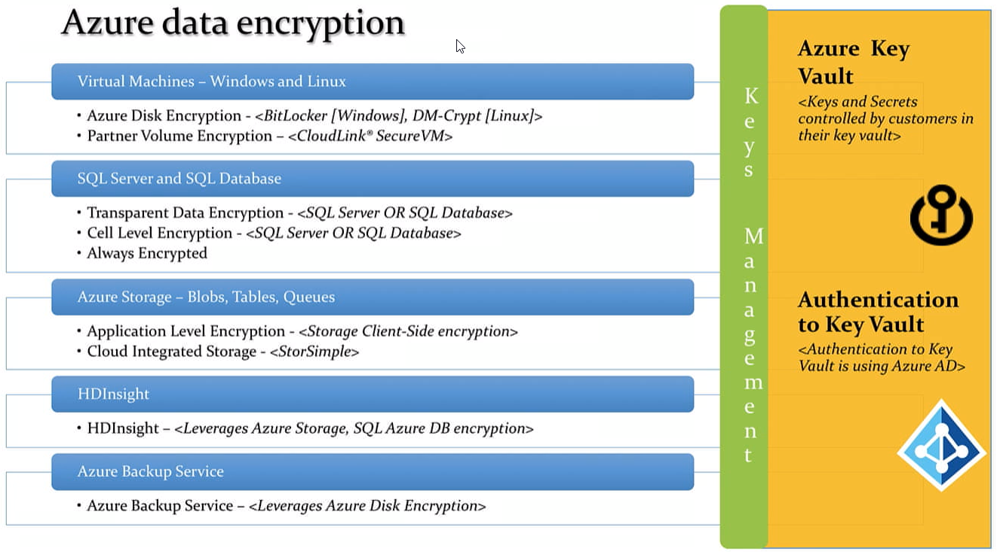

2019/Azure_Security
===================

.. post:: Feb 24, 2019
   :tags: security, cloud
   :category: ComputerScience

Azure security services out of a box 
--------------------------------------

Azure security general 
    ○ Azure Security Center 
    ○ Azure Key Vault 
    ○ Azure Disk Encryption 
    ○ Log Analytics 
    ○ Azure Dev/Test Labs 
Azure Storage Security 
    ○ Azure Storage Service Encryption 
    ○ StorSimple Encrypted Hybrid Storage 
    ○ Azure Client-Side Encryption 
    ○ Azure Storage Shared Access Signatures 
    ○ Azure Storage Account Keys 
    ○ Azure File Shares with SMB 3.0 Encryption 
    ○ Azure Storage Analytics 
Backup and Disaster Recovery 
    ○ Azure Backup 
    ○ Azure Site Recovery 
Azure Database Security 
    ○ Azure SQL Firewall 
    ○ Azure SQL Authentication 
    ○ Azure SQL Transparent Data Encryption 
    ○ Azure SQL Database Auditing 
Azure Identity and Access Management 
    ○ Azure Role Based Access Control 
    ○ Azure Active Directory /B2C/B2B 
    ○ Azure Multi-Factor Authentication 
Azure Networking 
    ○ Network Security Groups 
    ○ Azure VPN Gateway 
    ○ Azure Application Gateway 
    ○ Azure Load Balancer 
    ○ Azure Traffic Manager 
    ○ Azure Application Proxy 
    ○ Azure security services out of a box 

4 Easy Dance Moves Anyone Can Master 

	• Access control 
	• Data protection at rest 
	• Data protection in transit 
    Application security 

WAF: web application firewall

Hybrid identity with Microsoft Azure
Create a Directory
    Name must be unique on the internet

Comparision (table)
---------------------

Azure Active Directory

* Provide access to web-based services
* Identity infrastructure of the future
* Expanding constantly
* Limited but growing features
* Infrastructure background is a service
* Limited control over user environment

Active Directory Domain services

* Access to on-premises resources
* Current and past identity infrastructure
* Been pretty constant for over a decade
* Full featured implementation
* Infrastructure is built and maintained
* Fine-grain control of user environment

Custom domain name
	• To simplify the full name of azure AD url
    Verify through your own hosting website (e.g. hostmonster) 

Install Windows Azure AD for PowerShell
	• Search 'use powershell with azure active directory'
	• Go to web site: https://msdn.microsoft.com/en-us/library/jj151815.aspx
    Install the necessary software for powershell

Command line: Windows Azure Active Directory Module for Windows PowerShell

 
Azure Portal:
	• Create user
	• Create group
Sign-in in Url:
Login.microsoftonline.com
All the above actions can be done by Powershell
Connect-MsolService: to connect by using user name and password
New-MsolService: create a new user
Set-MsolService: change the user properties
Set-MsolUserPassWord

External account
Register devices

Connect tool: to connect the local AD to Azure AD
And you can activate or deactivate the sync between Azure AD and local AD
Synchronization Service Manager 
 
Azure Premium user: 
	can create group
    Get report