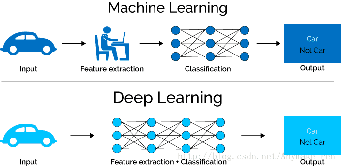

Machine Learning Basic
===========================

.. post:: Jan 13, 2019
   :tags:
   :category:

This blog introduces the basic knowledge of machine learning. The details of algorithm and programming will come in later blogs.
机器学习：不显式编程地赋予计算机能力的研究领域

.. contents::

Process
============

Machine learning project has its own process, which start with asking the right questions.

* Choosing what question to ask is the most important part of the process
* Ask yourself: Do you have the right data to answer the question?
* Ask yourself: Do you know how you'll measure success?

The process also includes re-create model regularly, see following picture.

.. image:: images/recreate_model_regularly.png

People are highly involved in the iteration of machine learning, e.g. adjusting algorithm, training data, selected features, parameters to algorithm.

CRISP-cycle
------------------

Cross-industry standard process for data mining, also known as CRISP-DM

* Business understanding
* Data understanding
* Data preparation
* Modeling
* Evaluation
* Deployment

Learning Algorithm Overview
====================================

The data contains the pattern, the algorithm find the patterns, and the trained model can recognizes the patterns.

Supervised Learning
--------------------------

The value you want to predict is in the training data. The data is labeled.

Supervised Learning includes the following algorithms:

* K-Nearest neighbors
* Linear regression (sigmoid function)
* Logistic regression (one-versus-all (OvA) strategy or one-versus-the-rest, one-versus-one (OvO) strategy)
* Support vector machines (SVMs)
* Decision trees and random forests
* Neural network

Unsupervised Learning
------------------------

The value you want to predict is not in the training data. The data is unlabeled.

Unsupervised Learning includes the following algorithms:

Clustering 
^^^^^^^^^^^^^^^^^^

Example question: What are our customer segments?

* k-means
* Hierarchical cluster analysis (HCA)
* Expectation maximization

Visualization and dimensionality reduction
^^^^^^^^^^^^^^^^^^^^^^^^^^^^^^^^^^^^^^^^^^^^^^^^^^^^

* Principal component analysis (PCA)
* Kernel PCA
* Locally-Linear embedding (LLE)
* t-distributed stochastic neighbor embedding (t-SNE)

simplify the data without losing too much information
One way to do this is to merge several correlated features into one => feature extraction

线性判别分析（Linear Discriminant Analysis)

Association rule learning
^^^^^^^^^^^^^^^^^^^^^^^^^^^^^^^^^

* Apriori
* Eclat

Unsupervised learning is also used on Anomaly detection use cases. distributed Gaussian正则分布

Semisupervised learning
------------------------------

deep belief networks (DBN) based on unsupervised components called restricted Boltzmann machines(RBMs)

Reinforcement learning
-----------------------------

agent can observe the environment, select and perform actions and get rewards in return. 
It must then learn by itself what is the best strategy, called a policy to get the most reward over time

Other algorithms
-------------------

Batch learning
^^^^^^^^^^^^^^^^^^^^^^^^^^^^^^^^^

the system is incapable of learning incrementally: it must be trained using all the available data.
	or offline learning. Retrain the model if necessary

Online learning
^^^^^^^^^^^^^^^^^^^^^^^^^^^^^^^^^

you train the system incrementally by feeding it data instances sequentially, either individually or by small groups called mini-batches or out-of-core learning, incremental learning
learning rate: how fast they should adapt to changing data

Instance based vs Model based learning
^^^^^^^^^^^^^^^^^^^^^^^^^^^^^^^^^^^^^^^^^^^^^^^^^^^^^^^^^^^^^^^^^^

Instance based learning: the system learns the examples by heart, then generalizes to new cases using a similarity measure
Model based: to build a model

.. image:: images/machine_learning_algorithm.png

Accuracy and Precision
=======================

There is no surprise for Machine Learning projects, one of the goal is achieve high enough accuracy.

The following picture explains the difference between Accuracy and Precision well.

.. image:: images/accuracy_precision.jpg

* High variance: overfitting
* High bias: underfitting

Utility function or fitness function
---------------------------------------

measures how good your model is or you can define a cost function that measures how bad it is
cost function apply on training set, gradient descent, used in regression
Stochastic Gradient Descent (SGD) classifier

我们需要对比模型的输出和真实值之间的误差。损失函数可以衡量输出结果对比真实数据的好坏。

Regularization
--------------------

Overfit: resolved by regulation, by reducing number of theta (degree of polynomial)

The amount of regularization to apply during learning can be controlled by a hyperparameter. A hyperparameter is a parameter of a learning algorithm (not of the model)

The importance of data versus algorithms

Measurement
-------------------------------

Root mean square error (RMSE): measures the standard deviation
Mean Absolute Error (MAE)
The higher the norm index, the more it focuses on large values and neglects small ones. This is why the RMSE is more sensitive to outlier than the MAE.

F1 score: for skewed class.

precision = TP/TP+FP
recall = TP/TP+FN
If someone says 'let's reach 99% precision', you should ask, 'at what recall'
ROC curve is a measure of binary classifier. Measure ROC AUC (area under the curve)

精度 = 1-错误率
训练误差 = 经验误差
新样本上叫泛化误差
只要相信“P != NP"，过拟合就不可避免

TP, FP, TN, FN
查准率P = TP/(TP+FP)
查全率R = TP/(TP+FN)
查准率和查全率是一对矛盾的度量，一般来说，查准率高时，查全率往往偏低；而查全率高时，查准率往往偏低。例如，若希望将好瓜尽可能低选出来，则通过增加选瓜的数量来实现，如果将所有西瓜都选上，那么所有的好瓜也必然都被选上了，但这样查准率就会降低；若希望选出的瓜中好瓜比例尽可能高，则可只挑选有把握的瓜，但这样就难免会漏掉不少好瓜，使得查全率较低。通常只有在一些简单任务中，才可使得查全率和查准率都很高
PR曲线
平衡点（Break-Even point) 查准率 = 查全率
ROC 受试者工作特性：Receiver Operating Characteristic
代价矩阵(cost matrix)：在不同的场合，错误的代价会不一样

K-folds cross-validation
----------------------------

3 dataset: train set, cross-validation set, test dataset
Accuracy is generally not the preferred performance measure for classifiers, especially when you are dealing with skewed datasets
A much better way to evaluate the performance of a classifier is to look at the confusion matrix.

训练/测试集的划分要尽量保持数据分布的一致性，避免因数据划分过程引入额外的偏差而对最终结果产生影响： 分层采样 - stratified sampling

均方误差（mean squared error)

Data Amount
--------------

The amount of data is also important for accuracy

Drawbacks
==================

https://www.quora.com/What-are-the-dangers-of-using-machine-learning-libraries-without-any-understanding

.. image:: images/cat.jpg

Here’s a picture of a cat right? Google’s Inception model thinks it’s a guacamole. 
As much as the image looks like a cat, the image is digitally altered which confused the model.

.. image:: images/rotate_cat.jpg

Slightly rotating the image led the model to correctly classify the image as a cat (and as an animal)

The above image is what’s called as an adversarial image, trying to fool your model into thinking the image is something you want it to be instead of what the image actually is.

I bring this example to illustrate the problem with the current AI trend. 
We have many technologies that allow us to use AI/ML (and not just deep learning) as a blackbox. 
The real danger is in the application, especially in healthcare and defense. 
For example, how would you convince that your model for predicting cancer actually works? 
How do you know your model is not susceptible to noise? How do you know that your model has actually learnt what it is supposed to be learning? 
How do you actually read interpretability here? 
If you can’t interpret what the model has learnt, then you can’t sell it.

https://www.theverge.com/2017/11/2/16597276/google-ai-image-attacks-adversarial-turtle-rifle-3d-printed

interpretability. 

But the questions to be asked are:

* How would you now ensure that the results be consistent in application, without posing any vulnerabilities or risk?
* Did you really need a AI/ML solution?

If you can't explain it simply, you don't understand it well enough
Albert Einstein

.. image:: images/ai_chasm.jpg

Others
==========

Cloud machine learning services
-----------------------------------------

Azure Cognitive Services
    Pattern recognition-as-a-Service

.. image:: images/azure_cognitive_services.png

Deep learning
-------------------

Will explain the details of deep learning in later blogs.

随着数据的增多，到达一定量后，深度学习算法的表现会明显优于传统的机器学习算法。

在机器学习中特征选择部分一般需要人的先验知识的介入来设计好的特征提取方法，
比如人知道轮子一般是圆的，一般出现在交通工具上，有轮胎、轮毂等部件，基于先验知识，人可以选取适合提取轮子特征的方法，再设计分类器以识别轮子。
而深度学习通常由多个层组成。
它们通常将更简单的模型组合在一起，通过将数据从一层传递到另一层来构建更复杂的模型。
通过大量数据的训练自动得到一个能识别轮子的模型，不需要人工设计特征提取环节。
这是深度学习随着数据量的增加而优于其他学习算法的主要原因之一。

*Written by Binwei@Singapore*
