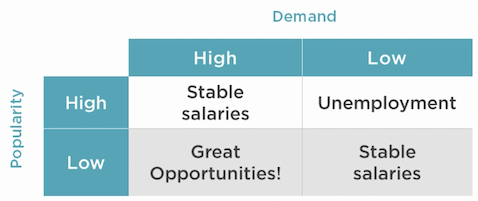
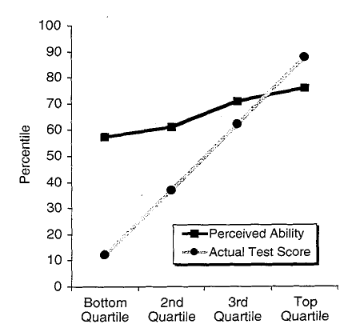

Intelligent Web Sentences
==============================

.. post:: Jun 07, 2020
   :tags: career
   :category: Life

I read a lot on Zhihu and Quora, and collect the followings intelligent sentences, even though they are not written by famous people.
They are full of wisdom, and mixed with Chinese and English.

.. contents::

Career
==========

Choose to learn
----------------

There are a lot of things to learn, then what to choose?

E = I x L / T

* I = Money, cash, income, potential income
* L = Lifespan, duration, how long until obsolescence
* T = Time spent learning, learning curve, investment
* E = Efficiency, return on investment

Of course, you also need to combine with your own interests and do not let the learning becomes your burden.

Also needs to combine with overall demand/supply in the labor market, see following salary ‘truth’ table

To whatever degree your career depends on technical ability, all else being equal, you have following choices:

* focus on getting stronger
* choose a space with less competition

稀缺性
--------------

没有需求，就没有价值，这是一切的基础。
在不同的场景，人对同一件事物可能会触发不同的需求。不同的需求导致价值判断的标准不同。

* 一杯咖啡在你家是咖啡，在星巴克里就是社交方式；
* 一杯水在你家里是饮用水，在沙漠里就是命。

如何提高自己未来的竞争力？
你有没有价值？你的能力是否是其他人需要的？
更关键的是，你值多少钱，竞争力有多强，是由你的能力是否是稀缺决定的

打造稀缺性有两个方法

* 成为第一
* 成为唯一

每多一个能力，你的不可替代性将会大幅度增加。
所以，让自己变得稀缺最好的办法，就是让自己拥有多维度能力！
多维能力要发挥价值，需要2个重要的前提条件

* 每个能力至少都是有价值的，也就是别人是需要的
* 每个能力之间要有关联

打造多维能力的步骤

* 先把一个能力打造成自己的长板
* 让自己兴趣广泛
* 确定一个目标，并把多维能力组合起来

提高竞争力
------------------

* 大方向要选好，方向不对、努力白费，看准一个行业，就持续的做，不能隔三差五换行业。不管是职场或是创业，长时间保持专注都是做出成绩的必要素质
* 精要主义，当前是互联网时代，信息爆炸，获取知识特别容易了，但每个人的时间和精力都是有限的，不能什么都想学，什么都不专，各行各业都在朝着细分化、精细化发展，让自己成为一个细分领域的专家，好过什么都懂一点，但什么都做不好。
* 在选定的领域内要广泛涉猎
* 建立可以迁移的能力，建立个人品牌终身为你创造价值。
* 做可积累的事情，想想看五年前你学的东西和你做的工作，对今天的你有没有帮助？
* 早知三日富贵十年其实说的就是对趋势的敏感度和把握度
* 长期视角，我们要学会跳出自己的轨道，从一个局外人的视角看自己所从事的职业或事业，尝试培养一种时空穿越的超能力，复盘一下自己的发展历程，假设你已经知道了今天的结果，如果给你一次机会倒回五年前或十年前，你会怎么做
* 化繁为简，有目的的做事。所以减少无效社交、减少社交媒体、降低把时间分割成碎片的概率，分清先后次序，一切都围绕这最重要的那件事情，也就是能够实现价值最大化的事情。
* 拒绝眼前的诱惑，必须利用好八小时以外的时间学习、训练一项长期技能，获得跳板和杠杆，步步为营渐入佳境
* 整合资源输出产品的能力
* 最直观的竞争力体验在价值和价格上面，让你的服务在你的领域具备高性价比和不可替代性，
* 逆向思维能力
* 杠杆他人和时间的能力，单打独斗再强也不可能做成大事，完成早期技术经验的积累后，必须建立复利思维，杠杆更多的人一起做一件事情，在你没有找到杠杆和复利建立起被动收入之前，你不可能实现财务自由
* 稳定的普世价值观是一种隐形竞争力，比如诚信、正直、利他、不违背良心……很多时候这比技能更重要，正所谓小胜靠智大胜靠德
* 坚持运动、健康饮食，健康的身体会帮助你保持活力和自信，是一切的基础！
* 谁掌握的稀缺性资源越多，谁利用资源的效率越高，谁就更具有争取社会财富的能力。
* 重复练习，进入一个领域，学习一门技能，反复练习是成为专家最笨但也是最快的手段
* 捷径就是最大的弯路
* 价值导向、结果导向
* 创业是挑战新的关卡，就像游戏一样，已经驾轻就熟了，紧着不解锁新地图也就没意思了，所以创业是优秀的升华，价值更大化的体现

如何写好简历
---------------

工作经历：每一份工作经历的描写，都用到了STAR法则

* Situation: 事情是在什么情况下发生
* Task: 你是如何明确你的任务的
* Action: 针对这样的情况分析，你采用了什么行动方式
* Result: 结果怎样，在这样的情况下你学习到了什么

简而言之，STAR法则，就是一个清晰、条理的作文模板。
不管是什么，合理熟练运用此法则，可以轻松的对面试官描述事物的逻辑方式，表现出自己分析阐述问题的清晰性、条理性和逻辑性

Hourly rate
---------------

Your annual salary / 2,080 hours = your hourly rate

Then decide how to invest your time with hourly rate in mind. Always look for ways you can spend some money to save time

How can one become part of 1%
-------------------------------

Do what the 1% does.
Success leaves clues. 
It’s not a mystery or an enigma. 
It’s a formula that anyone can follow.
The only problem? It’s REALLY F*&%$^G Hard!

* They Value Education Over Entertainment

They value education and constant growth.
They read every single day. They attend seminars. They hire coaches. If they watch television or play video games, they do so in a strategic manner designed to help them recharge, not to distract themselves from the tasks at hand.
I’ve never met someone who reads nonfiction books everyday for 30–60 minutes and isn’t wealthy. (With the rare exception of individuals who read all day but never take action.)
If you want to join the 1%, then this is where you start.
Double down on your education.
Learn about sales, marketing, psychology, high performance, productivity, business systems and finance.
Put down the remote and pick up a book.
It changed my life and it will change yours too.

* They Have a Plan and Stick to It

One of the key habits that differentiates high performers (1%’ers) from the rest of the population is that they are proactive instead of reactive.
Every night, they write out what they accomplished that day and what their plan is for the following day.
They have a clear list of priorities that they plan to accomplish.
They wake up before they need to, spend a few minutes exercising, reading, journaling and meditating before going to work or building their business.
When they start their day, they know exactly what needs to be done and why.
They methodically move through their most valuable priorities, avoiding distractions like email, social media and water cooler talk.
When the day ends, they’ve accomplished at least one or two of their biggest priorities and they learn from their mistakes so that they can avoid making those mistakes the next day.

Start by writing out a plan for the next 5 years of your life and figure out exactly what you want to accomplish.
Based on that document, plan for every day the night before. 
Put your gym clothes, journal and books somewhere they are easy to access and move your alarm across the room so that you can’t hit snooze.
This simple shift will radically alter your days and put you in a state of proactivity vs. reactivity.

* They Invest Their Money In Themselves and Other Appreciating Assets

Poor people spend money. Rich people invest.
They simply invest their money into appreciating assets… Namely, themselves.
1%’ers are notorious for spending lavishly on their own personal development and performance.
They will spend thousands (sometimes millions) of dollars on advanced training, high performance coaching, books, seminars, and lectures.
They invest in high quality supplements and a healthy diet that allows them to have high energy and enthusiasm throughout the day.
If you want to join the 1% then you must stop spending your money on pointless crap that doesn’t serve you.

* They Work On the Right Things

Poor people work on whatever is in front of them; rich people work on what’s most important to them.
They don’t work on the things that are easy. They work on the things that will get them results.
They know the power of saying “No” to things that don’t serve their ultimate vision and they have laser focus on their #1 most important goal.

* They Lay One Brick a Day

1%’ers operate by a philosophy known as “Kaizen” which loosely translates to “Small daily improvement”.
They don’t try to change everything all at once.
They are patient. They lay one brick a day.
They know that it’s the tiny actions (not the grand leaps) that determine a person’s destiny.
They understand the power of the compound effect.
1% compounded over ten years is a 3,650% improvement.
That’s the difference between earning $100,000 a year and earning $3.6 million a year.
Tap into this power and your life will change forever… IF you play the long game.

* They Play the Long Game

1%’ers understand that life is a game played in years and decades, not months.
They have goals for the next 30 and 90 days, yes. 
But they are more considerate of the next decade and how their actions today will impact them 10, 20, 30, and 40 years from now.
They act with a sense of urgency, but they don’t expect results to come quickly.
They simply take small daily actions everyday knowing that one day, the results will compound and they will have the life of their dreams.

* They Value the Power of Networking

1%’ers have allies. The 99% have friends.
Rich people understand the value of networking and giving value to others with no expectation of anything in return.
They intentionally build a network of people who are better than they are in their field. 
People who make them uncomfortable and insecure. 
People who challenge them to rise above mediocrity and achieve a life of success and integrity.

为人处事
===========

怼人
-----

遇到让自己不爽的事情，想要怼怼别人的时候，先把自己要说的话写下来，就当对面就是那个让自己很不爽的人。
写好后，放在一边，不发出去，让自己去做其他的事情。过几个小时再回来，这时候，你可能会奇妙地发现，自己的怒气减少了很多，再去看刚才写的文字，会觉得很多不妥的地方。
因为你再回来的时候，已经怒气全无，还会庆幸自己亏得没有发这些内容，不然多年的情谊可能就没了。
即使对方原谅了你，但是疙瘩已经结下了，要知道冤家宜解不宜结啊。

关于舒服的沟通
---------------

如果两人相处，对方让你感觉各方面都很舒服，很有可能对方在智商和情商各方面都在你之上。

这时候需要提起精神，好好想想该如何学习和提高。

不要和层次不同的人争辩
------------------------

那是对自己的一种无益的损耗。
这并不意味着软弱或退让，而是当你耗尽了精力，却难以消除人与人之间的认知差距。
你不可能用辩论击败无知的人。
对于层次不同的人，我们不必刻意相融，也不必试图去改变对方，只需待在各自的圈层内，结交一些气味相投、有着相同价值观的人，这样的人生，完全足矣。

联系老朋友
-------------

隔一段时间和好久不联系的朋友问候几句。

所以养成了这个习惯，主动去问候一下朋友们，问问他们最近怎么样了，也方便下次需要朋友帮忙的时候，显得没那么陌生。

当然目的也不能太功利

Become interesting
---------------------

I think someone is boring only if they themselves think they are uninteresting.  
These people do not know how to frame things in the right way.  
Every aspect of life is a story.

Scenario 1

* Hey, good seeing you, it's been forever!   How was your weekend?
* It was okay.
* What did you do?
* Nothing really.  Same old.

OR Scenario 2

* Hey, good seeing you, it's been forever!   How was your weekend?
* I did absolutely nothing.  I managed to stay in bed for 40 out of 48 hours.
* Record!  How'd you manage that... etc. etc.

Don't think you aren't interesting.  You are.  Everyone is.  
Life is a story, and as long as you can tell it right, no one can disagree.

Cool psychological hacks
----------------------------------

* Stay relaxed at your mistakes. So that people do not take them too seriously.
* Say let me check that. Whenever you don't have an info/ update for boss's questions instead of staring at him blankly ; pretend to be precise. You may tell” I’ll check that” with a serious sincerity.
* First draft should be simple. Let the boss exercise his passion to reject or correct. Your second draft will be accepted quickly.
* Self care reflects your self respect. Pay special attention to your personal hygeine, dressing, looks, body language and style. It reveals more than you tell.
* Never appear to be too perfect: “(People don’t care about those they can not identify with. Stop trying to prove yourself God’s Gift to the organization.)”
* Say less than required. “( They will definitely ask for more if needed.)”
* Show respect and care. This is the tried and tested way to win people’s hearts. They love to be taken seriously.
* Make your work seem effortless. “(Instead of showing how much you exert at work make your achievements seem effortless. Soon you will be rewarded with greater projects.)”
* Boss is always right. Proving him wrong by any logic reflects you are smarter than him ; he will never forgive you for that. Of course there can be exceptions but generally they are like that.
* Attitude matters. Whether you can do it or not there is no harm in saying yes to any assignment. Reservations can be discussed later. Nobody needs a superman but everybody desires a sweet, humble and agreeable gentleman.

生活哲理
=========

长期的安逸和舒适，削减了我们应对变化环境的能力，我们身边一切让生活变得更便利的东西：网购、外卖、空调，都在试图让我们逐渐依赖现代文明的保障，这种保障在不知不觉中夺走你的体能，同时也会将你的意志力一并打包带走。
体育运动真正的价值和意义，在于引导人们不断尝试新的极限，挑战原本被认为不可能的事情。
生活的意义，就是挑战极限，与自己作斗争，不断的提升自己的能力边界和上限；毕竟，即便是享受生活，也需要强健的体魄。
不要让体力，成为你从未预料的那块最短的木板。

高人指路
贵人相助
小人监督
敌人成就

你现在的气质里，藏着你读过的书，走过的路和爱过的人
你是砍柴的，他是放羊的，你和他聊了一天，他的羊吃饱了，你的柴呢？
一个不成熟的人的标志是他愿意为了某个理由轰轰烈烈地死去，而一个成熟的人的标志是他愿意为了某个谦恭的理由活着。——塞林格《麦田里的守望者》
备考就像黑屋子里洗衣服，你不知道洗干净没有，只能一遍一遍去洗。等到上了考场的那一刻，灯光亮了。你发现只要你认真洗过，那件衣服光亮如新，而你以后每次穿上那件衣服都会想起那段岁月
失去的东西，其实从来未曾真正地属于你，也不必惋惜。——《玫瑰的故事
人的一切痛苦，本质上都是对自己的无能的愤怒。——王小波
哪里会有人喜欢孤独，不过是不喜欢失望罢了。——村上春树《挪威的森林
之后的二十年，你更可能因为那些你没有去做的事情而后悔，而不是因为那些你做了的事。所以，扔开绳索，从安全的港口出发，在航行中遭遇信风、探索、梦想和发现。——马克·吐温
一个人知道自己为什么而活，就可以忍受任何一种生活。——尼采
我年青时以为金钱就是一切，而今年事已迈，发现果真如此。——奥斯卡.王尔德
做你自己，因为别人都有人做了。——王尔德
人会有三次成长
第一次是在，发现自己不是世界中心的时候；
第二次是在，发现即使再怎么努力，终究还是有些事令人无能为力的时候；
第三次是在，明知道有些事可能会无能为力，但还是会尽力争取的时候。
人一到群体中，智商就严重降低。为了获得认同，个体愿意抛弃是非，用智商去换取那份让人倍感安全的归属感。——勒庞《乌合之众
受人之恩不要忘，与人之恩不要提。——日本寺院
如果不知道一句话是否当讲，那就闭嘴别讲。
当别人在劝你接受一件事的时候，应该要做到嘴上多肯定，心里多否定。
以你的努力程度，还轮不到拼天赋。
你现在的生活也许不是你想要的，但绝对是你自找的。

You will never reach your destination if you stop and throw stones at every dog that barks
- Winston Churchill

个人提高
==========

思维升级
而真正能够帮助你减肥的，不是管住嘴，而是借助饮食，运动的规律性来加速你的新陈代谢率。
真正能让你摆脱工作负循环的，不是加班加点的穷忙，而是懂得做好计划，提升能力，辨别事情的轻重缓急。
其实，一个人对于时间的认知，往往决定了升维思考的高度。
当把思考架构于时间之上，我们的思维视角就提升到了一个新的高度。

去掉节点意识
比如我下周一开始，或者我明年再开始这样的意识，告诉自己一定要立马行动，行动力往往就拉开了你和别人的差距，所以，告诉自己一定不要拖延
睡前你可以对自己一天中所做的事情进行反思，今天哪些地方做的很好，哪些地方还有待欠缺，哪些事情影响了自己的心情，浪费了自己的时间，然后用一句话对自己所做的事情进行一个小结
作品意识
当我们通过积累、刻意练习出现一些效果的时候，你要学会把练习变成一种输出，也就是作品意识
现在是分享时代，不断积累和输出，既是对自己的一个督促，也是在等待机会到来时的一种储备

费曼学习法
第1步，学习一样新东西之后，用尽可能简单的语言解释给小孩听，或者对相关课题不了解的朋友听
第2步，找出别人听不懂的地方，或者是你本身无法简单解释的概念
第3步，回到学习资源，重新学习你的弱点，意识到能够简单地解释清楚为止
第4步，重复以上三个步骤，一直到你完全熟练相关的课题为止

.遇到不知道的就立刻去查资料，遇到感兴趣的也是
「两分钟法则」如果一件事能在两分钟之内决定并完成，那就立即着手去做，不要犹豫

What are the top hobbies that make you smarter?
Cubing (Solving Rubik's Cubes)
Writing Books
Studying Philosophy
Mental Math

Dunning Kruger Effect

I always look to Guy Kawasaki's 10-20-30 Rule.
1. 10 Slides
2. 20 Minutes to deliver the presentation
3. 30 is the minimum font size you are to use.

教育
=========

The most important things you can teach your child are:

1-5 years old:

* don't be afraid to try new things, even when you fall, I'll be there to catch you
* be nice to others
* say "thank you", and "sorry" when needed
* I'll always be there for you, you can count on that

5-15 years old:

* mean words can hurt, use them carefully
* nice words can make people feel better, learn those words
* don't succumb to being bullied
* don't become a bully
* don't sell your integrity for popularity
* not everyone can be trusted, learn about those dangers in the world
* I'll be there for you no matter what
* I trust your word more than anybody else's words
* developing core values for life
* power of decision, perseverance, delayed gratification, diligence, kindness, goodness

16 to 25 year old:

* how to make great decisions
* how to recognize, admit, correct own life mistakes
* how money works
* value of faith in ones life
* recognizing other's intentions
* living by your core values
* believing in yourself
* value yourself
* respect yourself
* respect others, but don't let them think  that they take advantage of you
* don't be fooled by people's words, watch their actions
* live with integrity
* using your talents to enrich the world
* finding your place in the world
* becoming independent thinker and doer
* using discernment in life
* prioritizing
* difference between good and bad
* not letting emotions rule your life
* acknowledging what's good and what's bad in own life, taking appropriate steps
* remember, that you are not alone, I'll be there when you need me, but at times for the sake of learning life, I'll let you pull yourself up by your own boot strings

善⾔者并不是演讲⽐赛得过什么奖，辩论赛多么⽜逼，⽽是通过和对⽅交流，短时间内可以正确识别并找出对方需求，然后寥寥数语就可以解决问题的人
在外求学和工作时，一周给家里视频一至两次，且每次不要超过30分钟。与家里保持联系，父母会觉得温暖。同时时间不要过长，别让父母觉得你还是小孩子
人生中的大部分苦恼和遗憾，都是钱不够引起的
要会赚钱，但不要急功近利
不要追机会，⽽要成为⼀个机会追你的⼈
有钱人更擅长投资，每一次投资都有长远的目的
用至少5年，深耕一个领域，做到1%，完成大量作品，是牛逼的唯一捷径
把钱当做「生产资料」，而不是「生活资料」
普通⼈是「存量思维」：⼿⾥有多少资源，才敢做多⼤的事情。 富人是「增量思维」：先定好一个目标，再开始考虑要怎样筹措资源。贫富差距就是这样拉开的
你手里的资金越多，你站的越高，对人性的把握越深
钱，权，色，一有俱有，一无俱无。盯准一个，必能成事；想要两个，陷入纠结；想要三个，必死无疑
钱能解决的事情，就用钱来解决；钱解决不了的事情，才考虑时间来解决
不逼自己一把，你永远不知道自己有多牛逼
持续性复盘反思，才能形成正向反馈
自我麻痹和感动，比放纵堕落更可怕
年轻人弱小的时候应该选择容错率高的⼯作，否则⾛错⼀步，万劫不复。容错率低的⾏业，⽐如卖保险、直销、传销，毕业⽣做了基本是耽误了⾃⼰
喜欢讲道理的人人缘都不好，也做不成事
评价你职场价值的唯一标准，就是结果
学会搭圈子，共享资源，形成朋友圈的合力，做大事
见不得人好的人，自己也不会好到哪去。有钱人擅长交换有用信息、互相帮助，而穷人稍微有些出头的窍门就不愿告知他人、生怕被他人知道，闭门造车。格局决定结局
工作以后，早点建立自己的个人品牌，越早越受益
超高性价比的投资——定期运动
保持苗条的身材，是你社交最值钱的名片
想得到一样东西，你首先要「认可自己」配得上它。好的东⻄，敢想也敢要。要相信⾃⼰配得上你不相信⾃⼰配得上，你就永远配不上
结果只是一时，把握规律才能常胜。要有对掌握规律的坚持，而不是对结果的执着
所谓渣不渣，全看立场和利益。⽴场和利益和你不⼀致，就是渣。⽴场和利益⼀致就是不渣。曾经的感情毛都不算
别总是骂别人是傻逼，多想想他哪里牛逼。别盲目妒忌身边人的成功，学会借鉴对方成功的经验
⼀个⼈真正长大，⼀定会经历几个撕心裂肺的瞬间，和三观的⼀次次颠覆。在这之后，开始⾃愈，最终学会看破不说破，知世故⽽不世故，温柔对待这个世界的好与不好

*Written by Binwei@Singapore*
